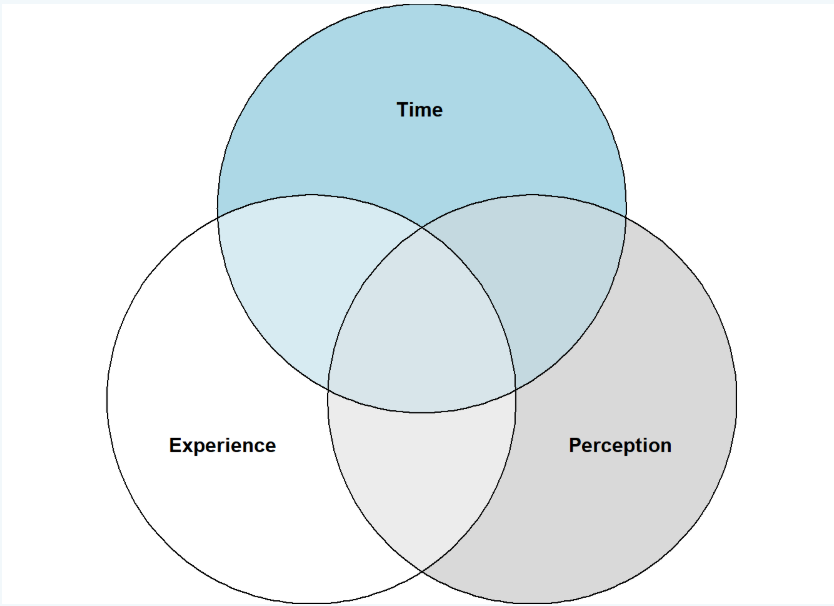

## Step 1: Load Required Packages

```{r}
#| label: install-load-packages
#| message: false
#| include: false
#| 
# install.packages("sets")
# install.packages("VennDiagram")

library(sets)
library(VennDiagram)

```

## Step 2: Define the Sets in RTC

We define:

- Experience ($E$): The fundamental integral of consciousness.
- Perception ($P$): The derivative of experience.
- Time ($T$): The rate of change of perception.

```{r}
#| code-fold: true
#| warning: false
# Define RTC sets using set theory notation
Experience <- set("E1", "E2", "E3", "E4")  # Elements of pure experience
Perception <- set("P1", "P2", "P3", "P4")  # Perception states
Time <- set("T1", "T2", "T3", "T4")        # Time moments as changes in perception

# Define their intersections
EP <- set_intersection(Experience, Perception)  # Overlap of experience & perception
PT <- set_intersection(Perception, Time)        # Overlap of perception & time
ET <- set_intersection(Experience, Time)        # Overlap of experience & time
```

## Step 3: Visualize RTC with a Venn Diagram

Now, we create a Venn diagram to illustrate how these sets interact.

```{r}
#| code-fold: true
#| warning: false
# Generate a Venn diagram of Experience, Perception, and Time
venn.plot <- draw.triple.venn(
  area1 = 4, area2 = 4, area3 = 4,        # Sizes of each set
  n12 = 2, n23 = 2, n13 = 2,              # Intersections (Experience-Perception, Perception-Time, Experience-Time)
  n123 = 1,                               # Intersection of all three (Unified Consciousness)
  category = c("Experience (E)", "Perception (P)", "Time (T)"),  
  fill = c("blue", "lightblue", "gray"),       
  alpha = 0.5,                            # Transparency for overlapping visualization
  cat.cex = 1.2,                          # Font size for labels
  cat.col = c("blue", "lightblue","gray"),    
  cex = 1.5,                              # Font size of numbers
  lty = "dashed"                          # Dashed outline for clarity
)

# Save the Venn Diagram to a file
pdf("RTC_VennDiagram.pdf")
grid.draw(venn.plot)
dev.off()
```

## Step 4: Explanation of the Diagram

1.  Experience ($E$) in Blue – Represents the integral of consciousness.
2.  Perception ($P$) in Lightblue – Represents the derivative of experience.
3.  Time ($T$) in Gray – Represents the rate of change of perception.
4.  Overlap Regions: $E$ ∩ $P$ (Blue & Lightblue): Perception emerges from experience. $P$ ∩ $T$ (Lightblue & Gray): Perception defines the experience of time. $E$ ∩ $T$ (Blue & Gray): Time is embedded in the unfolding of experience. $E$∩ $P$ ∩ $T$ (Center, all colors overlap): Unified field of consciousness.

### **Next Steps**

- You can **modify set sizes** or **adjust intersections** based on your RTC data.

- Try **`eulerr`** instead of `VennDiagram` for a more accurate representation of overlapping sets:

```{r}
#| code-fold: true
#| warning: false
#install.packages("eulerr")
library(eulerr)
plot(euler(c(Experience = 4, Perception = 4, Time = 4, "Experience&Perception" = 2, "Perception&Time" = 2, "Experience&Time" = 2, "Experience&Perception&Time" = 1)))

```

## Understanding the Overlapping Sections in the Venn Diagram of RTC

In the Resonance Theory of Consciousness (RTC), we model the relationship between Experience ($E$), Perception ($P$), and Time ($T$) using a Venn diagram. Each of these sets represents a fundamental aspect of consciousness. The overlapping sections between them indicate interdependencies that describe how consciousness unfolds dynamically.

1.  **Meaning of the Overlapping Section: Experience ∩ Perception (**$E$ ∩ $P$)

This overlap represents how perception emerges from experience.

Mathematical Representation:

$$P(t) = \frac{d}{dt}E(t)$$

This equation states that perception ($P$) is the derivative of experience ($E$) over time.

Conceptual Meaning:

- Experience ($E$) is the fundamental fabric of consciousness, the raw field of awareness before interpretation.

- Perception ($P$) is the processed form of experience, where the brain assigns meaning to raw sensory data.

- The overlap ($E$ ∩ $P$) represents the moment when raw experience is being interpreted as perception.

- This aligns with the idea that consciousness is not static but a continuous modulation of experience into perception.

Example in Consciousness: Imagine hearing a musical note. The raw sound wave hitting your eardrum belongs to the Experience Set ($E$). When your brain recognizes the note as a specific pitch (e.g., "A4 at 440 Hz"), that recognition belongs to the Perception Set ($P$). The overlap ($E$ ∩ $P$) is the moment when the sound transitions from a raw stimulus to a recognized perception.

2.  **Meaning of the Overlapping Section: Perception ∩ Time (**$P$ ∩ $T$)

This overlap represents how time is embedded within perception.

Mathematical Representation:

$$T = \frac{d}{dt}P(t)$$

This equation states that time ($T$) is the rate of change of perception ($P$).

Conceptual Meaning:

- Time ($T$) is not independent but emerges from the rate at which perceptions change.

- The overlap ($P$ ∩ $T$) represents the continuous updating of perception over time.

- Without change in perception, the experience of time would cease to exist. This suggests that time, as we perceive it, is a byproduct of shifting perception states.

Example in Consciousness: Consider watching a sunset. If your perception remains static, you do not perceive the sun moving. However, because your perception continuously updates, you observe the sun’s gradual descent. This perceptual change is what gives rise to your experience of time.

3.  **Meaning of the Overlapping Section: Experience ∩ Time (**$E$ **∩** $T$**) This overlap represents how experience unfolds over time.**

Mathematical Representation:

$$E(t) = B(t) \times F(t) $$

where:

- $𝐵$(𝑡) is the brain's wave modulation.

- $𝐹$(𝑡) is the holographic field of actual occasions.

- $𝐸$(𝑡) represents experience as a product of brain activity and the external vibrational field.

Conceptual Meaning:

- Experience ($E$) is not static; it is constantly evolving within a temporal framework.
- The overlap ($E$ ∩ $T$) represents the temporal nature of raw experience—meaning experience itself is time-dependent.
- Experience does not exist outside of time, as it is always unfolding moment-to-moment.

Example in Consciousness: When you recall a past event, the act of remembering is an experience ($E$) that occurs in the present moment ($T$). The overlap ($E$ ∩ $T$) captures this interplay—past experiences are reactivated in present time.

4.  **Meaning of the Central Overlap: Experience ∩ Perception ∩ Time (**$E$ ∩ $P$ ∩ $T$)

This central intersection represents the unified field of consciousness.

Mathematical Representation:

$$P(t) = \frac{d}{dt}(E(t) \times f_{mod}(t))$$

where:

- $f_{mod}(t)$ represents frequency modulation, capturing how experience changes over time.

- This equation shows that perception is shaped both by experience and by its modulation in time.

Conceptual Meaning:

- Experience ($E$), Perception ($P$), and Time ($T$) are inseparable.
- Consciousness is not a static entity; it exists as a flowing interaction between these three elements.
- The central overlap represents the real-time emergence of conscious awareness—how raw experience is processed into perception within the flow of time.

Example in Consciousness: Consider playing a musical instrument. The raw vibrations of the instrument belong to the Experience Set ($E$). Your brain processes and understands these vibrations as notes and melodies (Perception Set, $P$). The fact that the melody unfolds over time (Time Set, $T$) links all three elements. The center overlap is your real-time conscious experience of making music.

**Final Insights**

- RTC eliminates the need for a separate "Time Set" because time is embedded within perception.
- The overlapping regions in the Venn diagram describe how consciousness dynamically unfolds through the transformation of experience into perception within time.
- The central intersection ($E$ ∩ $P$ ∩ $T$) is the "resonant field of consciousness", where the brain’s wave modulation interacts with the holographic field, shaping our subjective reality.
